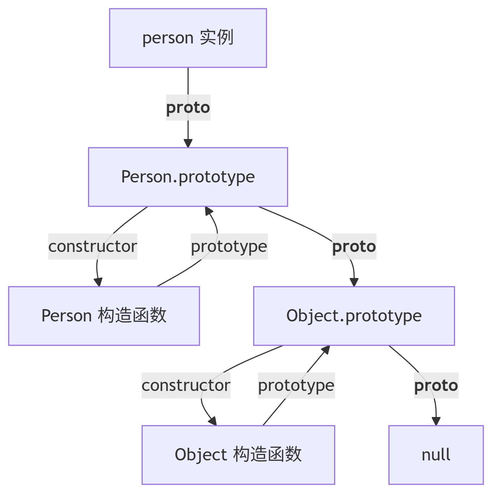

### this 指针/闭包/作用域

> 原型：任何一个 JS 对象创建时会关联的一个对象，任何根据原型的构造函数创建出的对象都会继承原型上的属性。

```js
function Person() {}
const person = new Person();

console.log(person.__proto__ === Person.prototype); // true
console.log(Person.prototype.constructor === Person); // true
console.log(Object.getPrototypeOf(person) === person.__proto__); // true
console.log(Person.prototype.constructor === Person); // true person没有prototype，要去原型Person上找
```



> 继承：任何对象会从原型继承属性（委托）

### 词法作用域 动态作用域

> 作用域：程序定义变量的区域 作用域中定义了如何好到对应的变量 在执行代码 运行在作用域 中，获取对变量的访问权限
>
> - JS 词法作用域（静态作用域）
> - 静态作用域：作用于在定义的时候确定的
> - 动态作用域：作用于在调用的时候决定的（bash）

```js
const value = 1;
function foo() {
  console.log(value);
}

function bar() {
  const value = 2;
  foo();
}

bar();
```

`value = 1`

```js
// case 1
var scope = "global scope";
function checkScope() {
  var scope = "local scope";
  function f() {
    return scope;
  }
  return f();
}
checkScope();

// case 2
var scope = "global scope";
function checkScope() {
  var scope = "local scope";
  function f() {
    return scope;
  }
  return f;
}
checkScope()();
```

`local scope`

### 执行上下文

```js
var foo = function () {
  console.log("foo1");
};

foo();

var foo = function () {
  console.log("foo2");
};

foo();
```

```js
function foo() {
  console.log("foo1");
}
foo();
function foo() {
  console.log("foo2");
}
foo();
```

---

这个现象涉及到 JavaScript 的两个重要概念：**变量提升（Hoisting）** 和 **函数声明与函数表达式**的区别

#### 第一种情况：函数表达式

```javascript
var foo = function () {
  console.log("foo1");
};

foo(); // 输出 "foo1"

var foo = function () {
  console.log("foo2");
};

foo(); // 输出 "foo2"
```

**输出结果**：`foo1` → `foo2`

##### 原因：

1. **变量提升**：`var` 声明的变量会被提升到作用域顶部，但**赋值不会提升**。

   - 实际执行顺序相当于：

     ```javascript
     var foo; // 声明提升（初始值为 undefined）
     var foo; // 重复声明被忽略

     foo = function () {
       console.log("foo1");
     };
     foo(); // 执行第一个函数

     foo = function () {
       console.log("foo2");
     };
     foo(); // 执行第二个函数
     ```

2. 函数表达式是运行时赋值，每次赋值都会覆盖前一个函数。

---

#### 第二种情况：函数声明

```javascript
function foo() {
  console.log("foo1");
}
foo();
function foo() {
  console.log("foo2");
}
foo();
```

**输出结果**：`foo2` → `foo2`

##### 原因：

1. **函数声明提升**：函数声明会整体提升（包括函数体），且**后面的声明会覆盖前面的**。

   - 实际执行顺序相当于：

     ```javascript
     // 后面的声明覆盖前面的
     function foo() {
       console.log("foo2");
     }

     foo(); // 执行的是最后定义的函数
     foo(); // 同上
     ```

2. 函数声明在编译阶段就完成了定义，运行时不会重新赋值。

---

### 关键区别总结

| 特性     | 函数表达式                 | 函数声明               |
| -------- | -------------------------- | ---------------------- |
| 提升方式 | 仅变量名提升（赋值不提升） | 整体提升（包括函数体） |
| 覆盖行为 | 运行时赋值覆盖             | 编译阶段直接覆盖       |
| 执行时机 | 运行时定义                 | 编译阶段定义           |
| 典型写法 | `var foo = function() {}`  | `function foo() {}`    |

---

### 扩展知识

1. **用 `let`/`const` 会怎样？**

   ```javascript
   let foo = function () {
     console.log("foo1");
   };
   foo(); // "foo1"
   let foo = function () {
     console.log("foo2");
   }; // 直接报错（重复声明）
   ```

2. **现代代码建议**：
   - 优先使用 `const` + 函数表达式：
     ```javascript
     const foo = () => console.log("foo1"); // 避免提升问题
     ```
   - 需要提升时再用函数声明：
     ```javascript
     foo(); // 可以正常调用
     function foo() {
       console.log("foo2");
     }
     ```

### 可执行代码

> 全局代码 函数代码 eval
>
> - executable code 可执行代码
> - executable context 执行上下文
> - executable context stack ECS 执行上下文栈 -> 先进后出

- 对于每个执行上下文，都有三个重要属性
  - 变量对象
  - 作用域链
  - this

#### 变量对象 variable object VO

> 在上下文中的变量或者函数声明
>
> - 全局上下文
> - 函数上下文 activation object 活动对象 AO

- 执行上下文代码
- 1. 进入执行上下文
  - VO：函数定义 声明 变量声明 函数的形参（没有实际的传入参数 arguments undefined）

```js
function foo(a) {
  var b = 2;
  function c() {}
  var d = function () {};
  b = 3;
}
foo(1);
```

```js
AO = {
  arguments: {
    0:1,
    length:1
  },
  a: 1,
  b: undefined,
  c: reference to function c() {},
  d: undefined
}
```

- 2. 执行

```js
AO = {
  arguments: {
    0:1,
    length:1
  },
  a: 1,
  b: 2,
  c: reference to function c() {},
  d: reference to FunctionExpression d
}
```

1.

```js
function foo() {
  console.log(a);
  a = 1;
}
foo();
```

```js
AO = {
  arguments: {
    length: 0,
  },
};
// 找不到a 所以报错
globalVO = {};
```

2.

```js
function foo() {
  console.log(a);
  var a = 1;
}
foo();
```

```js
AO = {
  arguments: {
    length: 0,
  },
  a: undefined,
};
// undefined
```

3.

```js
function foo() {
  a = 1;
  console.log(a);
}
foo();
```

```js
AO = {
  arguments: {
    length: 0,
  },
};

globalVO = {
  a: 1,
}; // 在函数执行中赋值，一开始也是没有的
/** 这里没有用 var/let/const 声明变量，所以：
 * 首先在函数作用域内查找 a
 * 没找到会向外层作用域查找
 * 最终在全局作用域创建 a（相当于 window.a = 1）
 * 这是一个隐式全局变量（严格模式下会报错）
 **/
```

```js
function foo() {

  
  var b = 2; // 函数作用域
  c = 3; // 隐式全局
}
foo();
console.log(c); // 3（全局可访问）
console.log(b); // 报错（函数作用域外不可访问）
```

#### 作用域链

> 找变量，先从当前上下文中找，找不到，到词法作用域的上一级找，直到找到全局上下文中的变量对象为止
